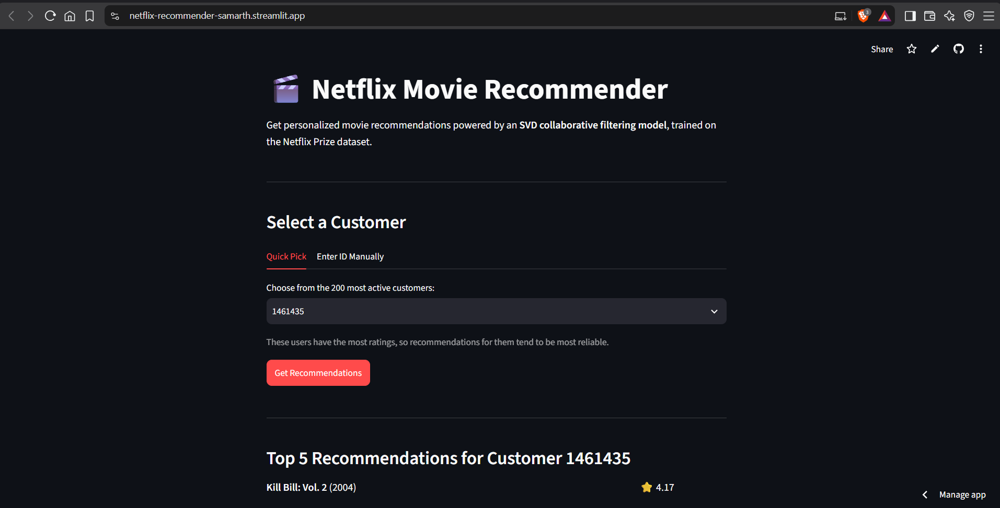
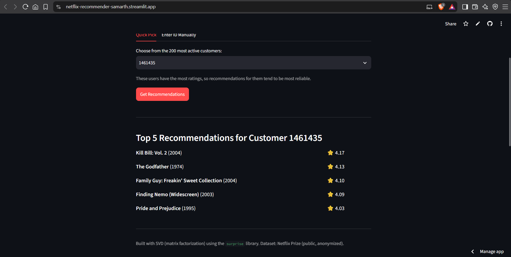
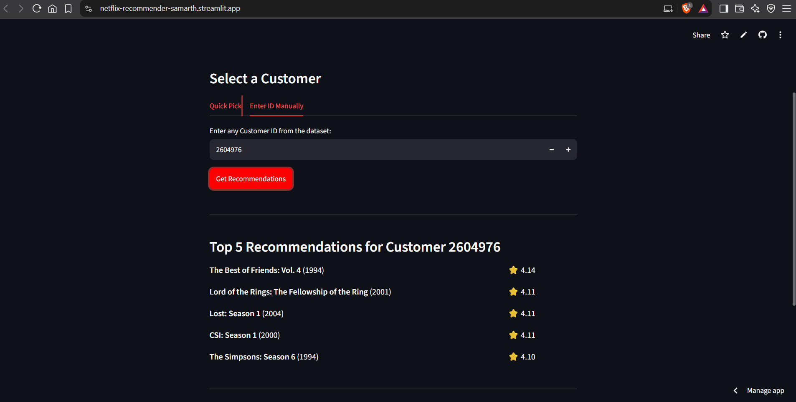

# 🎬 Netflix Movie Recommender

A collaborative-filtering movie recommendation engine built on the historic **Netflix Prize dataset**, using **SVD (matrix factorization)** and deployed as an interactive **Streamlit** web app.

🔗 **Live Demo:** [Click here to try it](https://netflix-recommender-samarth.streamlit.app/)



---

## 📌 Overview

This project predicts how a user would rate movies they haven't seen yet, using historical rating patterns from ~100 million anonymized Netflix ratings (2006 Netflix Prize dataset). It demonstrates a full ML pipeline — from raw, messy data parsing to a deployed, production-style app.

---

## ⚙️ How It Works

1. **Data parsing** — Raw `.txt` files (custom Netflix format with embedded movie markers) parsed into a clean `Cust_Id, Movie_Id, Rating` structure.
2. **Data cleaning** — Sparse movies and low-activity customers filtered out using quantile-based thresholding, reducing noise.
3. **Model training** — Collaborative filtering via **SVD**, using [`scikit-surprise`](https://surpriselib.com/), which learns latent factors representing user tastes and movie characteristics.
4. **Evaluation** — Benchmarked against a random baseline and SVD++ using RMSE/MAE via 3-fold cross-validation.
5. **Deployment** — Wrapped in a Streamlit app, deployed on Streamlit Community Cloud.

---

## 📊 Model Evaluation

| Model | RMSE | MAE |
|---|---|---|
| Random Baseline | 1.447 | 1.162 |
| **SVD** | **1.006** | **0.809** |
| SVD++ | 1.009 | 0.818 |

SVD outperforms random guessing by ~30%, confirming it captures real user-rating patterns. SVD++ showed no meaningful gain here — likely due to sample size — so plain SVD was selected for its better speed/accuracy tradeoff.

---

## 🖥️ App Features

**Quick Pick** — choose from the 200 most active customers in the dataset for fast, reliable recommendations.



**Manual Entry** — enter any valid customer ID directly.



---

## 🛠️ Tech Stack

- **Python** — pandas, NumPy
- **scikit-surprise** — SVD, SVD++, cross-validation
- **Streamlit** — interactive web app
- **Streamlit Community Cloud** — deployment

---

## 📂 Project Structure

netflix-movie-recommender/
├── app.py # Streamlit app
├── Netflix-Project Modified.ipynb # Full data pipeline + model training
├── svd_model.pkl # Trained SVD model
├── movie_titles_clean.csv # Movie metadata
├── top_customers.json # Top 200 active customer IDs
├── all_customer_ids.json # All valid customer IDs
├── drop_movie_list.json # Filtered-out low-rated movies
├── requirements.txt
└── README.md


---

## 🚀 Running Locally

```bash
git clone https://github.com/samarthboraste/netflix-movie-recommender.git
cd netflix-movie-recommender
pip install -r requirements.txt
streamlit run app.py
```

---

## 🔍 Key Learnings

- Encountered and fixed a subtle bug where scalar assignment (instead of a per-row list) silently mislabeled an entire column — a good reminder to validate assumptions about pandas broadcasting.
- Observed **popularity bias** in SVD predictions on smaller training samples — a well-documented challenge in real-world recommender systems, typically mitigated with re-ranking or diversity-aware techniques in production.
- Learned the practical tradeoffs between SVD and SVD++ (accuracy vs. training time) firsthand via cross-validation rather than assumption.

---

## 📈 Future Improvements

- Train on the full 24M-row dataset for stronger personalization
- Explore implicit feedback models (e.g., `LightFM`) for a more modern hybrid approach
- Add content-based filtering (genre/cast) to reduce cold-start issues for new users

---

## 📬 Contact

**Samarth Boraste**
[GitHub](https://github.com/samarthboraste) · [LinkedIn](#www.linkedin.com/in/samarthb77)
